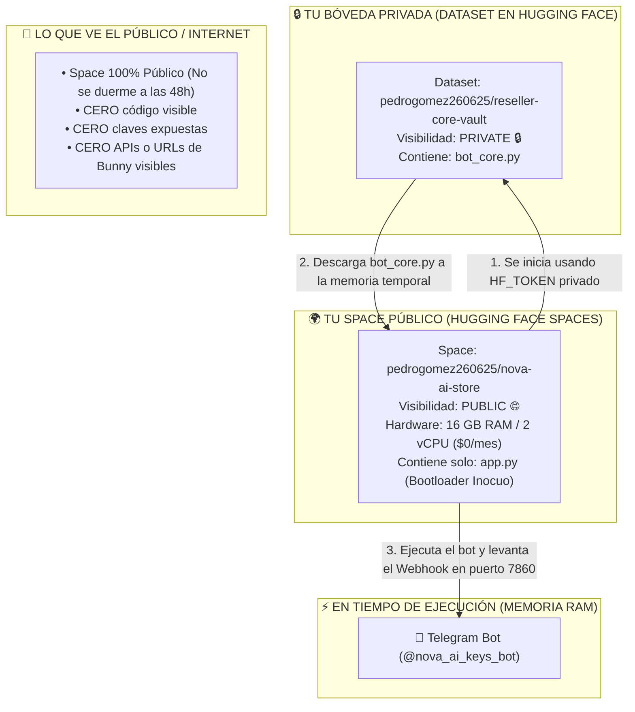

# 🛡️ GUÍA MAESTRA: PATRÓN SIGILOSO EN HUGGING FACE (DATASET PRIVADO + SPACE PÚBLICO)
### Blindaje 100% Invisible de Código, Margen y APIs con 16 GB de RAM Gratis
**Identidad Operativa:** `pedrogomez260625-ops` | `pedrogomez260625@proton.me`

---

## 🧠 ¿CÓMO FUNCIONA ESTE TRUCO DE INGENIERÍA?

---

## 🛠️ PASO 1: CREAR EL DATASET PRIVADO EN HUGGING FACE (1 Minuto)

1. Entra a [https://huggingface.co/new-dataset](https://huggingface.co/new-dataset).
2. Completa los campos:
   - **Dataset name:** `reseller-core-vault`
   - **Visibility:** Marca **`Private`** 🔒 *(¡Es fundamental que sea privado!)*
3. Haz clic en **Create dataset**.
4. Ve a la pestaña **Files** ➔ **Add file** ➔ **Upload files** y sube el archivo:
   📁 [`C:\Users\rafae\.gemini\01_PROYECTOS\planes_jules_2026\0032-ghost-reseller-hub\despliegues_multicloud\huggingface_stealth\private_dataset\bot_core.py`](file:///C:/Users/rafae/.gemini/01_PROYECTOS/planes_jules_2026/0032-ghost-reseller-hub/despliegues_multicloud/huggingface_stealth/private_dataset/bot_core.py)
5. Haz clic en **Commit changes to main**.

---

## 🔑 PASO 2: OBTENER TU ACCESS TOKEN DE HUGGING FACE (30 Segundos)

1. En Hugging Face, ve a tu perfil (arriba a la derecha) ➔ **Settings** ➔ **Access Tokens** (o ve a [https://huggingface.co/settings/tokens](https://huggingface.co/settings/tokens)).
2. Si ya tienes un token con permisos de `Read` o `Write`, puedes usarlo.
3. Si no, haz clic en **Create new token**:
   - **Name:** `Stealth-Reader`
   - **Type:** `Read` (o `Fine-grained` con acceso a Datasets).
4. Copia el token (empieza con `hf_...`).

---

## 🚀 PASO 3: CREAR EL SPACE PÚBLICO (1 Minuto)

1. Entra a [https://huggingface.co/new-space](https://huggingface.co/new-space).
2. Completa los campos:
   - **Space name:** `nova-ai-store` (o el que prefieras).
   - **Select Space SDK:** Elige **`Docker`** (Blank).
   - **Space Hardware:** Free (2 vCPU - 16 GB RAM).
   - **Visibility:** **`Public`** 🌐 *(Debe ser público para que Telegram pueda enviarle datos y para no tener la limitación de 48h)*.
3. Haz clic en **Create Space**.
4. En la pestaña **Files** ➔ **Add file** ➔ **Upload files**, sube los 4 archivos de:
   📁 [`C:\Users\rafae\.gemini\01_PROYECTOS\planes_jules_2026\0032-ghost-reseller-hub\despliegues_multicloud\huggingface_stealth\public_space`](file:///C:/Users/rafae/.gemini/01_PROYECTOS/planes_jules_2026/0032-ghost-reseller-hub/despliegues_multicloud/huggingface_stealth/public_space)
   *(Son: `Dockerfile`, `app.py`, `requirements.txt`, `README.md`)*.
5. Haz clic en **Commit changes to main**.

---

## 🔒 PASO 4: CONFIGURAR LOS SECRETOS EN EL SPACE

1. Dentro de tu nuevo Space, ve a la pestaña **Settings** (arriba a la derecha).
2. Desplázate hacia abajo hasta **Variables and secrets** ➔ **New secret**.
3. Añade los siguientes secretos:

| Secret Name | Valor | Descripción |
| :--- | :--- | :--- |
| `HF_TOKEN` | `hf_tu_token_aqui` | Para descargar el `bot_core.py` del Dataset privado |
| `DATASET_REPO` | `pedrogomez260625/reseller-core-vault` | Ruta exacta de tu dataset privado |
| `TELEGRAM_BOT_TOKEN` | `YOUR_TELEGRAM_BOT_TOKEN` | Token de `@nova_ai_keys_bot` |
| `RESELLER_API_KEY` | `YOUR_BUNNY_API_KEY` | Clave API de Bunny Tools |
| `ADMIN_TELEGRAM_ID` | `1849945160` | Tu ID de Telegram (@Cctes001) |

4. Guarda los secretos. Hugging Face reiniciará el Space automáticamente.

---

## 🟢 RESULTADO FINAL

* Hugging Face compilará el Space público.
* Al arrancar, el bootloader descargará `bot_core.py` de tu dataset privado, lo ejecutará en memoria y activará el Webhook de Telegram.
* El público solo verá un Space limpio y genérico; **nadie podrá ver tu lógica, márgenes, billeteras ni proveedores**.
* El bot `@nova_ai_keys_bot` responderá 24/7 con los 20 productos actualizados en tiempo real.

---
[VINCIT_OMNIA_VERITAS]
