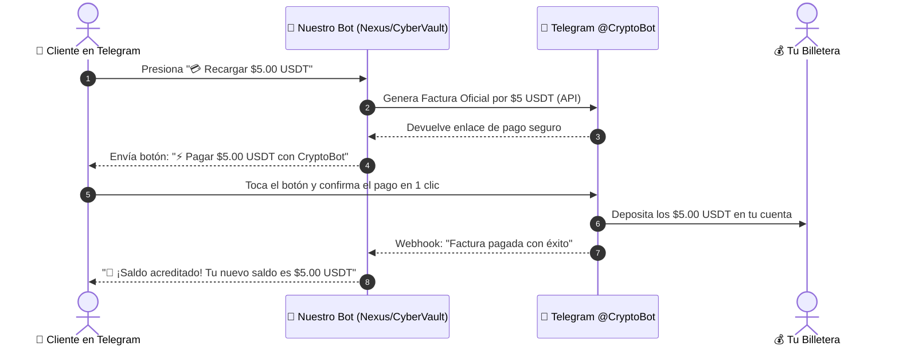

# 💳 GUÍA MAESTRA: RECARGAS AUTOMÁTICAS CON CRYPTO PAY (@CryptoBot)
### Sistema de Cobro Autónomo 24/7 sin Intervención Manual
**Ecosistema:** Nexus Reseller Hub | **Identidad:** `pedrogomez260625-ops`

---

## 🌟 1. ¿QUÉ ES CRYPTO PAY Y POR QUÉ ES PERFECTO PARA NUESTROS BOTS?

**Crypto Pay** es la pasarela de pagos oficial del ecosistema de Telegram (@CryptoBot).

### 🚀 ¿Cómo funciona para el cliente y para ti?



### ✨ Ventajas Principales:
1. **100% Automático:** Tú no tienes que revisar comprobantes ni escribir comandos para dar saldo. El cliente recarga a las 3:00 AM y el bot lo atiende solo.
2. **Cero Comisiones de Gas:** Las transferencias dentro de `@CryptoBot` son instantáneas y no cobran tarifas de minería de red.
3. **Múltiples Monedas:** El cliente puede pagar con **USDT, TON, BTC, ETH, SOL, BNB o TRX**.

---

## 🛠️ 2. PASO A PASO: CÓMO OBTENER TU API TOKEN DE CRYPTO PAY (1 MINUTO)

Sigue estos sencillos pasos desde tu cuenta de Telegram:

### 1️⃣ Paso 1: Abrir @CryptoBot
* Abre Telegram y busca **`@CryptoBot`** (o entra a [t.me/CryptoBot](https://t.me/CryptoBot)).

### 2️⃣ Paso 2: Abrir el Menú de Crypto Pay
* En el chat con `@CryptoBot`, envía el comando:
  ```text
  /pay
  ```
  *(O toca el botón **Crypto Pay** en el menú principal).*

### 3️⃣ Paso 3: Crear tu Aplicación de Cobro
1. Toca en el botón **`Create App`** (o `My Apps` ➔ `Create App`).
2. `@CryptoBot` te pedirá un nombre para tu app de cobro. Escribe:
   ```text
   Nexus Digital Store
   ```
3. ¡Listo! `@CryptoBot` te responderá felicitándote y te entregará tu **API Token**.

---

## 🔑 3. ¿CÓMO SE VE EL API TOKEN DE CRYPTO PAY?

El token que te da `@CryptoBot` tiene un formato parecido a este:
```text
123456:AAFd9jK... (Un número seguido de dos puntos y letras)
```

---

## ⚙️ 4. ¿QUÉ HAREMOS CON ESE TOKEN?

Una vez que tengas ese token:
1. Me lo pasas por aquí.
2. Lo integramos en el código de **Render** y **Pella**.
3. En el menú de **"💳 Recargar Saldo"** de tus bots aparecerán botones interactivos:
   * `[ 💵 Recargar $3.00 USDT ]`
   * `[ 💵 Recargar $5.00 USDT ]`
   * `[ 💵 Recargar $10.00 USDT ]`
   * `[ 💵 Recargar Otro Monto ]`
4. Cuando el cliente toque cualquiera de esos botones, se generará la factura automática y al pagar, el saldo se acreditará en 0.1 segundos en su cuenta.

---

## 💰 5. ¿DÓNDE RECOGES TUS GANANCIAS?

Todo el dinero que los clientes paguen a través de las facturas:
1. Se acumula directamente en tu saldo de **`@CryptoBot`**.
2. Desde `@CryptoBot` puedes:
   * Retirarlo a tu billetera personal (MetaMask, Trust Wallet, Binance, etc.) cuando quieras.
   * Venderlo por dinero fiat local (pesos, dólares) en el mercado P2P integrado de Telegram.

---
[VINCIT_OMNIA_VERITAS]
